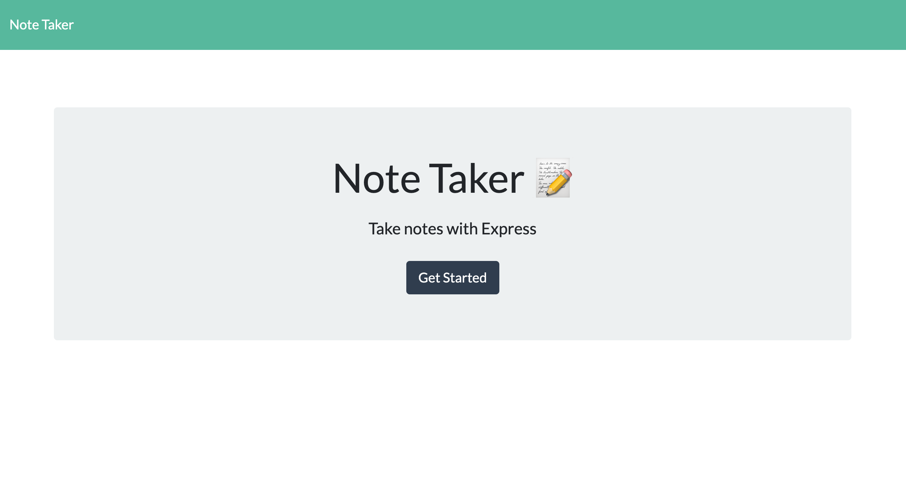
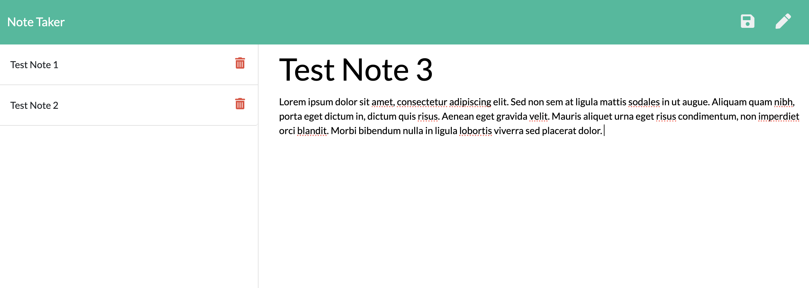

# note-taker
Bootcamp Module 11: Express.js Challenge - Note Taker

## Express.js Challenge: Note Taker
In this project, we were asked to create a Note Taker application that can be used to write, save, and delete notes. This application uses an Express.js back end and saves and retrieves note data from a JSON file.

## URLs submitted
* Heroku App URL: https://dry-sands-61604-5aca233b3a98.herokuapp.com/
* My Github Repo URL: https://github.com/lenzlee/note-taker 

## References/Resources
I mostly referred to our recent lessons/activities for this assignment. 

For NPM Packages:
* File System: https://nodejs.org/docs/latest-v18.x/api/fs.html 

## My Application Screenshots

